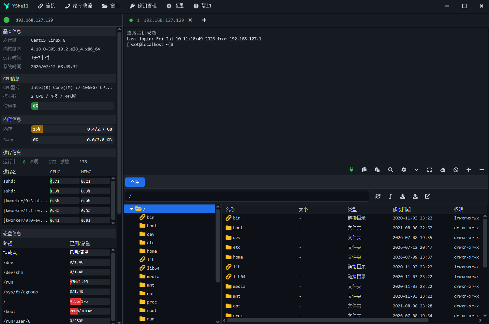

# YShell - 开源 SSH 客户端

<p align="left">
  
</p>

<p align="left">
  <strong>一款跨平台 SSH 客户端</strong>
</p>

<p align="left">
  基于 Java + JavaFX 构建，轻量、易用、功能丰富
</p>

---

## 功能特性

### 已实现功能

#### 连接管理

| 功能 | 描述 |
|------|------|
| SSH 远程连接 | 支持密码认证、私钥认证、键盘交互认证 |
| RDP 远程桌面 | Windows 使用 mstsc，Linux/macOS 使用 FreeRDP，支持全屏模式和磁盘映射 |
| 代理支持 | HTTP 代理、SOCKS5 代理，支持认证 |
| SSH 密钥管理 | 导入、管理 SSH 密钥，支持带密码的密钥 |
| 服务器分组 | 按项目或环境分组管理服务器 |
| 服务器搜索 | 快速搜索已保存的服务器 |
| 最近连接 | 记录最近连接的服务器，快速重连 |
| 快捷连接 | 无需保存配置，快速输入地址连接 |

#### 终端功能

| 功能 | 描述 |
|------|------|
| 交互式终端 | 基于 JediTerm，支持 ANSI 颜色显示 |
| PTY 自适应 | 终端窗口大小变化时自动调整远端 PTY |
| 多标签页 | 同时管理多个服务器连接，标签页切换 |
| 终端搜索 | 在终端输出中搜索文本 |
| 字体调整 | 支持增大/减小终端字体 |

#### 文件管理

| 功能 | 描述 |
|------|------|
| SFTP 文件浏览器 | 浏览远程服务器文件系统 |
| 文件上传/下载 | 支持单文件和批量传输 |
| 文件传输队列 | 管理传输任务，显示进度和状态 |
| 目录操作 | 创建、删除、重命名目录 |
| 文件操作 | 创建、删除、重命名文件 |
| 权限修改 | chmod 修改文件权限，支持递归 |
| 压缩解压 | 远程创建 tar.gz 压缩包、解压到指定目录 |
| 文件编辑 | 远程文件在线编辑器 |

#### 系统监控

| 功能 | 描述 |
|------|------|
| CPU 监控 | 实时显示 CPU 使用率、核心数、线程数 |
| 内存监控 | 内存使用量、Swap 使用量 |
| 磀盘监控 | 磁盘使用量、挂载点信息 |
| 网络监控 | 网卡选择、上传/下载速度实时图表 |
| 进程监控 | 进程总数、运行进程、资源占用最高的进程 |
| 系统信息 | 发行版、内核版本、运行时间、延迟测试 |

#### 命令管理

| 功能 | 描述 |
|------|------|
| 批量命令执行 | 多服务器同时执行相同命令 |
| 命令库管理 | 保存常用命令，分类管理 |
| 命令搜索 | 搜索已保存的命令 |

#### 端口转发

| 功能 | 描述 |
|------|------|
| 本地端口转发 | 将远程端口映射到本地 |
| 远程端口转发 | 将本地端口映射到远程 |
| SOCKS5 动态转发 | 创建本地 SOCKS5 代理 |

#### Docker 管理

| 功能 | 描述 |
|------|------|
| Docker 概览 | 显示 Docker 版本、API 版本、容器/镜像/网络/存储卷数量 |
| 容器管理 | 查看详情、实时日志、进入容器、资源占用、进程、文件变更、重命名、拷贝文件、启动/停止/重启/删除/暂停/恢复 |
| 镜像管理 | 拉取、加载本地镜像、删除、清理无用镜像、清理悬空镜像、查看详情/历史、导出、打标签、推送 |
| 运行镜像 | 支持快速运行和自定义运行；自定义运行支持容器名、端口、数据卷、环境变量、重启策略和高级参数预览 |
| 网络管理 | 创建/删除网络，查看网络详情，连接/断开容器 |
| 存储卷管理 | 创建/删除/清理无用卷，查看详情、使用容器、占用大小，并可在终端跳转到挂载点目录 |
| Docker 配置 | 读取、保存、编辑 Docker 配置，并支持重启 Docker 服务 |
| 镜像仓库 | 支持配置 Docker Registry，用于镜像推送和登录 |

#### Kubernetes 管理

| 功能 | 描述 |
|------|------|
| 集群概览 | 显示 Kubernetes 客户端与服务端版本、连接状态和命名空间 |
| 资源浏览 | 浏览 Pods、Deployments、Services、ConfigMaps、Secrets 等 Kubernetes 资源 |
| 命名空间筛选 | 按命名空间筛选资源，支持查看全部命名空间 |
| 资源操作 | 支持创建、查看详情、编辑 YAML、删除、扩缩容、重启工作负载等常用操作 |
| 资源检索 | 支持资源搜索、分页浏览和按创建时间排序 |

#### 其他功能

| 功能 | 描述 |
|------|------|
| 主题切换 | 亮色主题、暗色主题 |
| 自动更新 | 检查新版本，自动下载更新 |
| 弱网络优化 | 压缩传输、超时延长、低画质 RDP |
| 单实例运行 | 防止重复启动 |
| AI 助手 | 支持多模型对话、流式输出、思考过程、图片提问、历史会话与终端命令执行 |

---

## 界面预览

### 主界面

<p align="center">
  
</p>

> 主界面展示：左侧服务器列表与实时监控面板，右侧多标签页终端和 SFTP 文件浏览器。

---

## 快速开始

### 环境要求

- **JDK 20+**
- **Maven 3.6+**（IDE 运行可不依赖命令行 Maven）

### 方式一：IDE 直接运行

1. 用 IDEA / Eclipse 等 IDE 打开项目
2. 等待 Maven 自动下载依赖
3. 直接运行 `com.yshell.Launch` 类的 `main` 方法

```
src/main/java/com/yshell/Launch.java
```

### 方式二：命令行运行

```bash
# 克隆项目（替换为实际的仓库地址）
git clone https://gitee.com/<你的用户名>/yshell.git

# 进入项目目录
cd yshell

# 编译打包
mvn clean package

# 运行应用
mvn javafx:run
```

---

## 使用说明

### SSH 连接

1. 在服务器列表中**双击**服务器，或点击「**快捷连接**」输入地址
2. 选择认证方式：密码 / 私钥 / 键盘交互
3. 连接成功后自动打开终端和文件浏览器

### RDP 远程桌面

1. 添加服务器时选择类型为 **RDP**
2. 设置主机地址和端口（默认 3389）
3. 可选全屏模式、磁盘映射、弱网络优化

### 文件管理

- **上传**：拖拽本地文件到文件浏览器，或点击上传按钮
- **下载**：选择远程文件，点击下载按钮
- **编辑**：双击文本文件打开编辑器
- **传输队列**：查看和管理传输任务

### 端口转发

1. 编辑服务器连接，添加端口转发规则
2. 选择类型：本地转发 / 远程转发 / SOCKS5
3. 设置监听端口和目标地址

### 系统监控

连接成功后，左侧面板实时显示：
- CPU、内存、磁盘使用率
- 网络上传/下载速度（可选网卡）
- 进程列表和资源占用
- 系统运行时间和延迟

### Kubernetes 管理

1. 连接到已安装并配置 `kubectl` 的服务器
2. 在右侧可视区切换到 **K8s** 标签页
3. 选择资源类型与命名空间，使用搜索、分页和刷新查看资源
4. 选中资源后可查看详情，并执行创建、编辑、删除、扩缩容或重启等操作

### AI 助手

1. 在右侧可视区切换到 **AI 助手** 标签页
2. 点击 **配置** 添加并选择可用的 AI 模型连接
3. 输入 Linux、Docker 或 Kubernetes 相关问题；支持附加图片、查看历史会话和流式回答
4. 对回答中的命令确认无误后，可直接发送到当前终端执行

### 主题切换

菜单栏选择「**主题**」，切换亮色/暗色主题，设置自动保存。

---

## 许可证

本项目基于 [MIT License](LICENSE) 开源。
